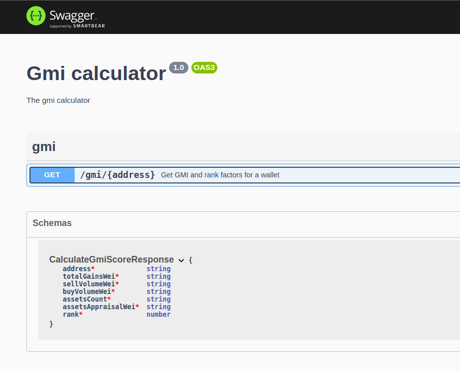

# Principles
* GET GMI request should be super cheap to perform, and should not trigger any external requests and unnecessary recalculations
* NFT events synchronization and ranking factor recalculation should be done in the background, and should not interfere with GMI calculation
* The synchronization mechanism should guarantee data consistency and should ensure that the database state is as real-time as possible (see #Assumptions)
* The system will store trades, wallets, and collection assets in the local database. Wallet entity will be used as rank parameters store, assets entity will store current owner and estimated price
* The first, initial synchronization of all NFT events related to CryptoPunks collection will take minutes to complete.
  In addition, based on synchronized trades and assets, the system should be able to calculate initial rank factors, hence the GMI calculation is expected to be functional after initial synchronization completion
* After the first synchronization, the system should periodically (as often as possible) process incremental synchronization of collection events to make sure that the system is up-to-date.
  Those incremental synchronizations should be based on `synchronizedUntil` timestamp
* The architecture is prepared to be ready for the switch from pull-based synchronization to event-driven/push approach
* All runtime math operations should be done via Big lib to be as precise as possible 

# The problems and assumptions:
* The volume of the past owners will be stored in the database.
  Given the past owner becomes owner again, it will streamline the GMI calculation.
  However, I'm not sure if that strategy is the best because theoretically speaking, in the future, the amount of the past owners can,
  let say - 100x, and most of them probably won't jump back on the bandwagon. Given that upshot's collection/events api could not filter by addresses,
  this approach seems to be the only one that makes sense.
* GMI calculation will also rank wallets against past owners' wallets
* Group/sum database queries are used to generate ranking factors in the initial synchronization,
  and I'm not 100% sure if the field type `decimal(36,0)` is accurate and precise enough to operate without floating-point errors or roundings.
* If the given wallet address is not found that could mean:
    - wallet never owned anything from that collection or
    - events related to this wallet e.g. sale events, were not processed yet by the incremental synchronization

# Why this solution will not be truly real-time?
The currently implemented synchronize mechanism is based on the assumption that:
* assets appraisals are updated only when a given asset has been traded or transferred, and that is a huge simplification because other factors like off-chain events
  like tweets from celebrities (e.g Elon Musk) or other events non-related to this collection could influence the collection appraisal.
* to operate that system in a true real-time fashion, basically every GET GMI score request
  would have to trigger a recalculation of all assets/wallets and that operation will be uber expensive

# Why this solution will not scale?
Using rest api to frequently update such a big amount of data will never be a good choice, at least in the current upshot's API form.
A poll strategy is not the best choice for this kind of system, a push strategy would be much better.
The whole concept behind incremental sync is based on processing the new NFT events one by one to build up-to-date state
of the collection and wallets in the database, and that's mean in the current implementation that it
can't be done in the parallel in many instances

# How to scale it then?
The only doable way I see right now is to change the approach from pull-synchronization
to the push/reactive/event-driven one. E.g. to use upshot's webhook/queue to individually track each
* asset appraisal change
* asset trade/sale event

and gradually recalculate affected assets and wallets scoring

The problem is, such API does not exist yet. Even tho if the push API will be there, it will definitely take longer
than 6h to build such a complex system.

# What could be done better?
* wallet entity is used as a store of current ranking factors of a given wallet, it would be much nicer to have a ranking factor change log, and a way to materialize those into current
  state - something like time-series with points or materialized view
* synchronization could be delegated into another microservice
* currently implemented version of incremental sync is: rushed (objectively the worst piece of code there), and hugely simplified. 
In the real application some kind of queue/cron must be there to operate that kind of process. Due of time constraint, I've created that code to showcase idea rather than
create working solution, so only the super happy path is covered, exceptions during incremental sync will break the whole mechanism
* tests...

# Upshot Api feedback:
* timestamp fields have inconsistent types e.g. in collection/assets ep, the last sale timestamp is `numeric` and appraisal timestamp is `string`

# Setup

* Copy/rename `env.example` file to `.env`
* Copy/rename & configure `docker-compose.override.yml.example` file to `docker-compose.override.yml`
* Run `docker-compose up -d`
* Run `docker-compose exec gmi-service npm run migration:run`
* Run `docker-compose exec gmi-service npm run cli initial-sync`
* Run `docker-compose restart gmi-service`

# API
* `GET /gmi/:address` - GMI ep

# Swagger
http://localhost/api

